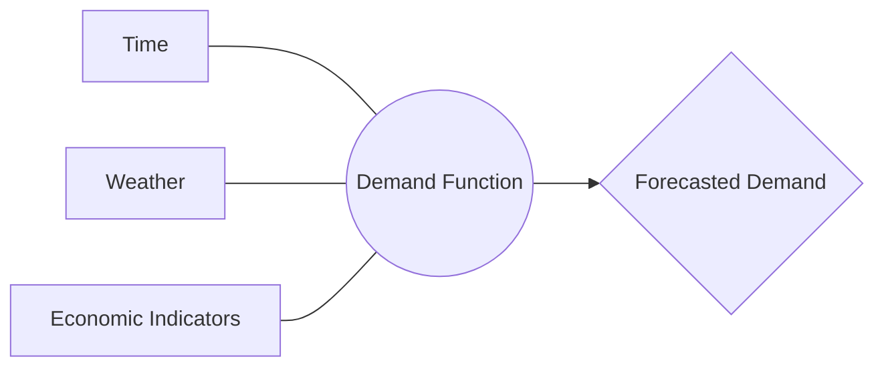

# 02. Mathematical Modeling of Demand

## Mathematical Formulation of Demand
We define the energy demand at any given time $t$ as a multivariate function. This means the demand isn't just a single line, but a surface influenced by multiple drivers.

### Formulation
The generic demand function is expressed as:
$$D(t) = f(t, W(t), E(t)) + \varepsilon$$

Where:
- **$D(t)$**: Demand at time $t$ (The target Variable).
- **$t$**: Time component (capturing seasonality like day/night cycles).
- **$W(t)$**: Weather vector (Temperature, Humidity, Wind speed).
- **$E(t)$**: Economic vector (Industrial output, GDP proxies, Energy prices).
- **$\varepsilon$**: Stochastic noise (Unpredictable human behavior or sensor errors).

---

## Piecewise Interpolation Formulation
To handle missing data ($D_{miss}$), we formulate the function using a **Cubic Spline** $S(t)$. For each interval $[t_i, t_{i+1}]$, the demand is represented by a third-degree polynomial:

$$S_i(t) = a_i + b_i(t - t_i) + c_i(t - t_i)^2 + d_i(t - t_i)^3$$

### Continuity Constraints
To ensure Mathematical Rigour, the following conditions must be met at each node (joint):
1.  **Function Continuity**: $S_i(t_{i+1}) = S_{i+1}(t_{i+1})$
2.  **First Derivative Continuity**: $S'_i(t_{i+1}) = S'_{i+1}(t_{i+1})$ (Smoothness)
3.  **Second Derivative Continuity**: $S''_i(t_{i+1}) = S''_{i+1}(t_{i+1})$ (Curvature balance)

This allows the grid operator to have a continuous, differentiable signal for calculating Rates of Change.

### Relationships
The relationship between these variables is often nonlinear. For example, energy demand doesn't just increase as it gets hotter; it stays low in moderate weather and spikes sharply once the temperature crosses a threshold for air conditioning.

[Return to README](./README.md) | [Next: Numerical Methods](./03_numerical_methods.md)
