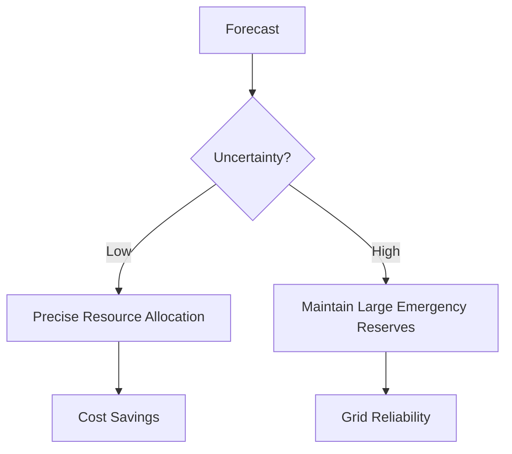

# 06. Operational Grid Decisions

How does a graph on a computer screen become a decision on the power grid? 

## 1. Balancing Supply and Demand
The grid operator's primary job is to ensure that the amount of electricity being generated is *exactly* equal to the amount being consumed.

### Decision Matrix
| Forecast Scenario | Grid Status | Operator Action |
| :--- | :--- | :--- |
| **Under-forecast** | Not enough power. | Risk of blackouts; emergency power purchase. |
| **Over-forecast** | Wasted energy. | High costs; need to shut down plants (slow process). |
| **Accurate** | Optimal. | Efficient dispatch; lowest cost to consumer. |

---

## 2. Uncertainty Interpretation
Forecasters often provide a **Confidence Interval** (e.g., "Demand will be between 500MW and 550MW").

- **Narrow Interval (High Certainty)**: The operator can plan with precision, keeping low reserves.
- **Wide Interval (Low Certainty)**: The operator must keep "spinning reserves" (generators running but not outputting power) ready for a sudden spike.

### Real-world Insights
- **Peaker Plants**: If a sensitivity analysis shows a heatwave coming, operators start expensive "Peaker plants" ahead of time.
- **Demand Response**: Utilities might send signals to smart appliances to reduce power if the forecast predicts a peak that exceeds supply.

[Return to README](./README.md) | [Previous: Stability & Error Analysis](./05_stability_error_analysis.md) | [Next: Conclusion](./07_conclusion.md)
