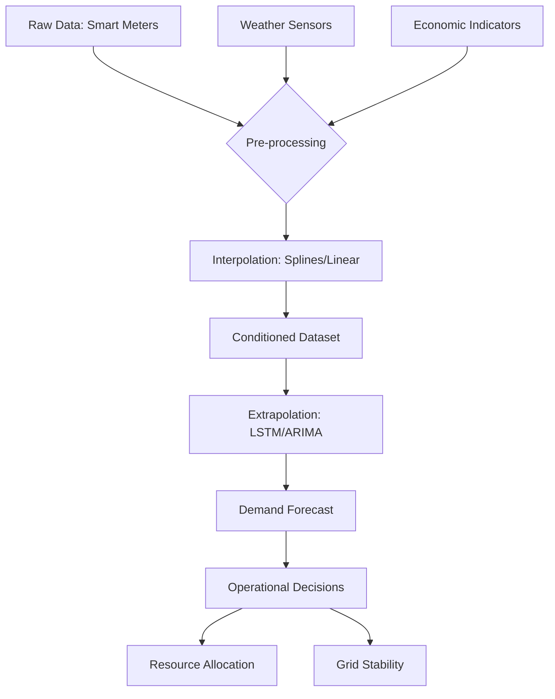

# Energy Demand Forecasting in Smart Grids

## Overview
Energy demand forecasting is the backbone of modern power systems. It involves predicting future electricity consumption to ensure that supply matches demand efficiently. In smart grids, this is achieved by analyzing historical data paired with external factors like weather and economic indicators.

### Key Objectives
- **Interpolation**: Filling in the "blanks" caused by sensor outages.
- **Extrapolation**: Predicting future demand trends.
- **Sensitivity**: Understanding how small changes (like a 1°C temperature rise) impact the grid.
- **Decision Support**: Guiding real-world utility operations.

---

## Documentation Structure
To explore this case study, follow the numbered sections below:

1.  [**Introduction**](./01_introduction.md) - Context and the role of smart grids.
2.  [**Mathematical Modeling**](./02_mathematical_modeling.md) - Formulating the demand function.
3.  [**Numerical Methods**](./03_numerical_methods.md) - Techniques for interpolation and extrapolation.
4.  [**Sensitivity Analysis**](./04_sensitivity_analysis.md) - derivatives and rates of change.
5.  [**Stability & Error Analysis**](./05_stability_error_analysis.md) - Numerical stability and error propagation.
6.  [**Operational Decisions**](./06_operational_decisions.md) - Real-world grid management.
7.  [**Conclusion**](./07_conclusion.md) - Final synthesis and summary.
8.  [**References**](./08_references.md) - Sources and further reading.

---

### System Architecture

